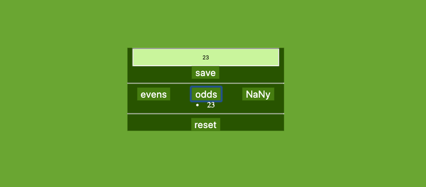

# Even or Odd

### This website will sort user-provided input into three categories, *NaNy* characters and *odd* or *even* numbers.

> 

### Specifications:
 * If a user inputs the same value twice, it will pop an **alert** that will warn about the same character input or the same sharacter that is already saved. So all the lists will never have repeated values.
* After a user has removed a value from the state, they should be able to add it again.
This code was well organized with `development-strategy` 

* Please check it out by the following link [projects](https://klisabeth.github.io/even-or-odd/.) 

